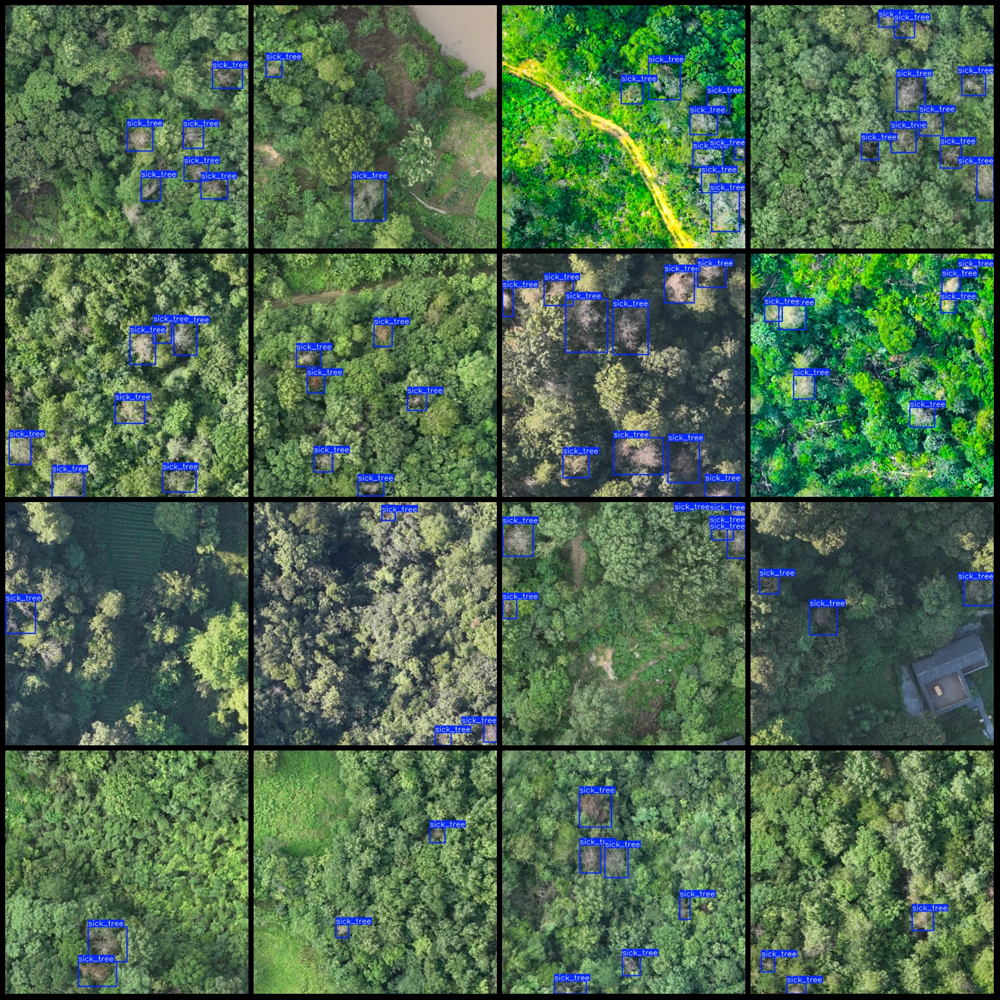
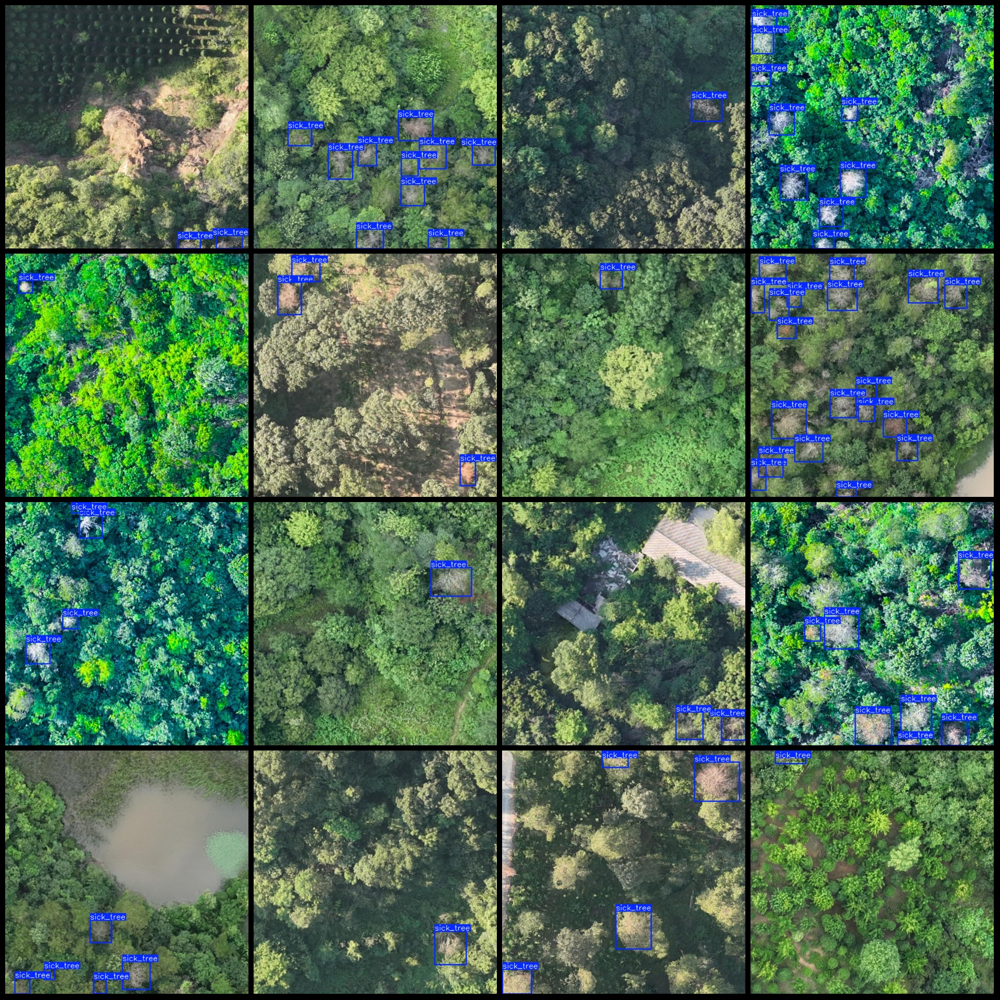

# UAV Perspective Sick Tree Detection Dataset (VOC+YOLO)

The dataset format: Pascal VOC format + YOLO format (txt file without split path, only containing jpg images and corresponding VOC format xml files and YOLO format txt files).

Image count (number of jpg files): 1208
Annotation count (number of xml files): 1208
Annotation count (txt files): 1208
Number of annotation categories: 1
Annotation category name: ["sick_tree"]
Number of bounding boxes per category:
- sick_tree = 5740
Total bounding boxes: 5740
Image resolution: 640x640
UAV: DJI MAVIC 3
Height of collection: 50m
Angle of collection: 90°
Annotation tool used: labelImg
Annotation rules: draw a box around the category.
Important note: The dataset does not have separate training, validation, or testing sets; you must divide it yourself.
Special declaration: This dataset does not guarantee the accuracy of the trained models or weight files.
Image preview:

## Images

Here is a pay link on Stripe ( https://buy.stripe.com/3cs8yP7sY87d0vu9AB ). Please contact me lonlonago@foxmail.com after funding $89, and I will send you a complete data files , thank you!

